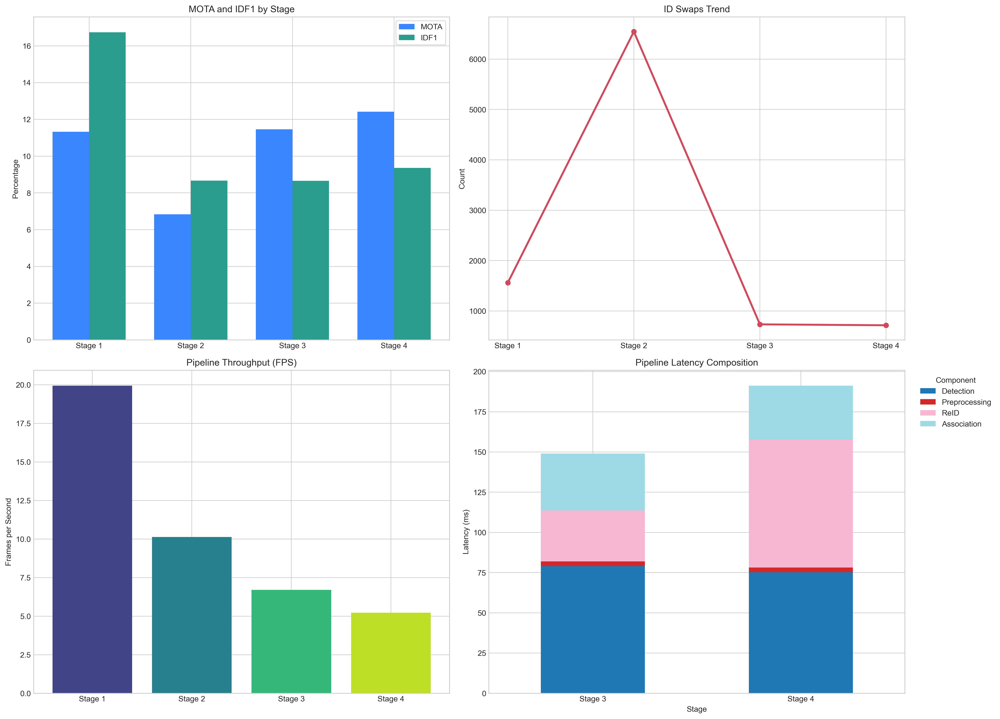
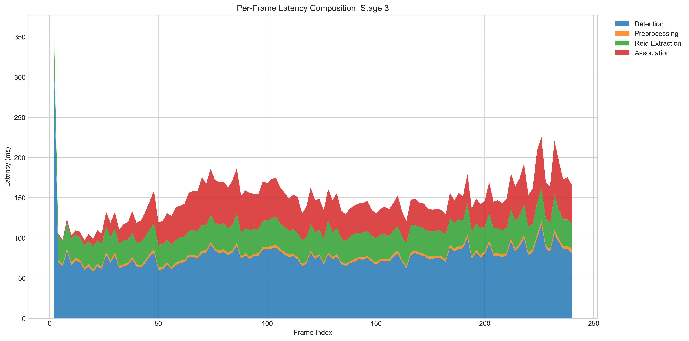
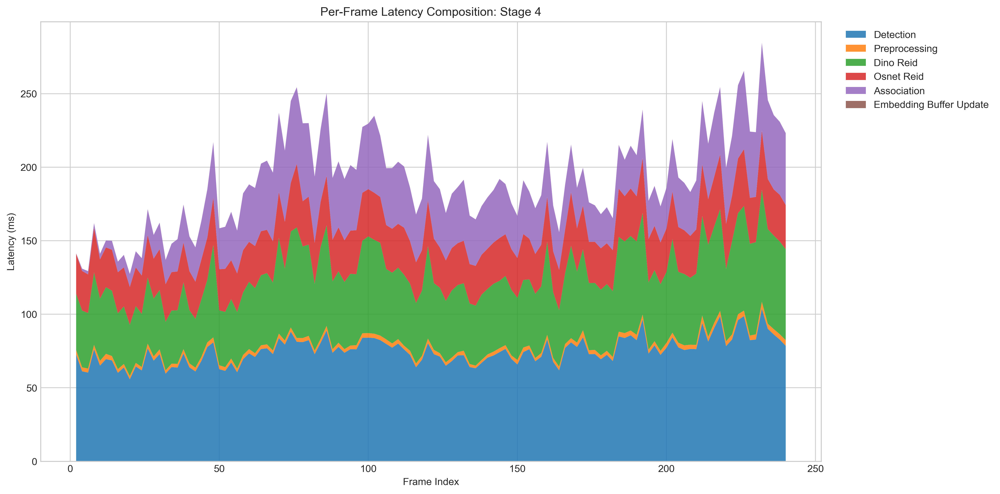

# ReID Investigation

Goal: Reproducible research workspace for soccer object detection, tracking, and ReID experiments;

## Overview

This repository contains a modular pipeline for Stage 1 baseline evaluation and later ReID stages;
Core logic is implemented in Python modules, while notebooks are used for orchestration and analysis;

## Result Snapshots

Latest selected figures are stored in `docs/images/` and are safe to keep in Git;







## Project Structure

- `core/`: Abstract contracts for detectors and trackers;
- `models/`: Concrete detector and tracker implementations;
- `utils/`: Data loading, metrics, and video helpers;
- `configs/`: YAML experiment configurations;
- `experiments/`: Research notebooks;

## Requirements

- Python: `3.12`;
- Package manager: `uv`;
- Runtime target: Kaggle Notebook;

## Local Setup

```powershell
uv venv
.\.venv\Scripts\activate
uv pip install --python .\.venv\Scripts\python.exe -r requirements.txt
```

## Colab Setup

Use the Stage 1 notebook in `experiments/01_stage1_baseline.ipynb`;

For private repositories, provide a GitHub token before running the bootstrap cell;

```python
%env GITHUB_TOKEN=your_read_only_pat
%env REID_REPO_URL=https://github.com/<owner>/<repo>.git
```

Notes: Keep token scopes minimal and never commit tokens or notebook outputs with secrets;

## Kaggle Setup

Use the following initialization cell at the top of a Kaggle notebook;

```python
from pathlib import Path
import os
import shutil
import subprocess
import sys

REPO_URL = os.environ.get("REID_REPO_URL", "https://github.com/ituvtu/reid_investigation.git")
WORKSPACE_ROOT = Path("/kaggle/working")
PROJECT_ROOT = WORKSPACE_ROOT / "reid_investigation"

if not PROJECT_ROOT.exists():
    subprocess.run(["git", "clone", REPO_URL, str(PROJECT_ROOT)], check=True)

os.chdir(PROJECT_ROOT)

if str(PROJECT_ROOT) not in sys.path:
    sys.path.insert(0, str(PROJECT_ROOT))

if shutil.which("uv") is None:
    subprocess.run([sys.executable, "-m", "pip", "install", "uv"], check=True)

subprocess.run(["uv", "pip", "install", "-r", "requirements.txt", "--system"], check=True)

print(f"Project root: {PROJECT_ROOT};")
print(f"Python executable: {sys.executable};")
```

The cell is incremental and stateful for the same Kaggle session because it reuses `/kaggle/working/reid_investigation` when already cloned;

## Kaggle Dataset Integration

Option 1 - Search and attach an existing Kaggle dataset;

```python
import os
import subprocess
from pathlib import Path

subprocess.run(["kaggle", "datasets", "list", "-s", "soccernet tracking"], check=False)

# After attaching the dataset in the Kaggle notebook UI, set SOCCERNET_ROOT_DIR;
candidate_paths = sorted(Path("/kaggle/input").glob("*soccernet*"))
if candidate_paths:
    os.environ["SOCCERNET_ROOT_DIR"] = str(candidate_paths[0])

print("SOCCERNET_ROOT_DIR:", os.environ.get("SOCCERNET_ROOT_DIR", "<not-set>"))
```

Option 2 - Download via SoccerNet API to writable Kaggle storage;

```python
import importlib.util
import os
import subprocess
import sys
from pathlib import Path

download_root = Path(os.environ.get("SOCCERNET_DOWNLOAD_ROOT", "/kaggle/working/data/SoccerNet"))
download_root.mkdir(parents=True, exist_ok=True)

if importlib.util.find_spec("SoccerNet") is None:
    subprocess.run([sys.executable, "-m", "pip", "install", "SoccerNet"], check=True)

from SoccerNet.Downloader import SoccerNetDownloader

downloader = SoccerNetDownloader(LocalDirectory=str(download_root))
downloader.downloadDataTask(task="tracking", split=["train", "valid", "test"], password=None)

os.environ["SOCCERNET_ROOT_DIR"] = str(download_root)
print("SOCCERNET_ROOT_DIR:", os.environ["SOCCERNET_ROOT_DIR"])
```

## Running Stage 1

1. Open `experiments/01_stage1_baseline.ipynb`;
2. Run the bootstrap cell to resolve project path and install dependencies;
3. Run the detector and tracker initialization cell;
4. Run dataset loading and metrics cells;

## Repository Hygiene

- `.gitignore` excludes local environments, outputs, caches, and secrets;
- Commit source modules, configs, notebooks, and documentation only;
- Keep long-run generated artifacts under `reports/analysis/` as local workspace outputs;
- Keep curated README figures under `docs/images/`;
- Do not commit dataset files, model weights, or personal IDE settings;

## Analysis Artifacts Policy

- `reports/analysis/` is treated as transient output space;
- Keep `.png` and `.svg` for analysis exports when needed;
- Do not generate or store `.pdf` artifacts;
